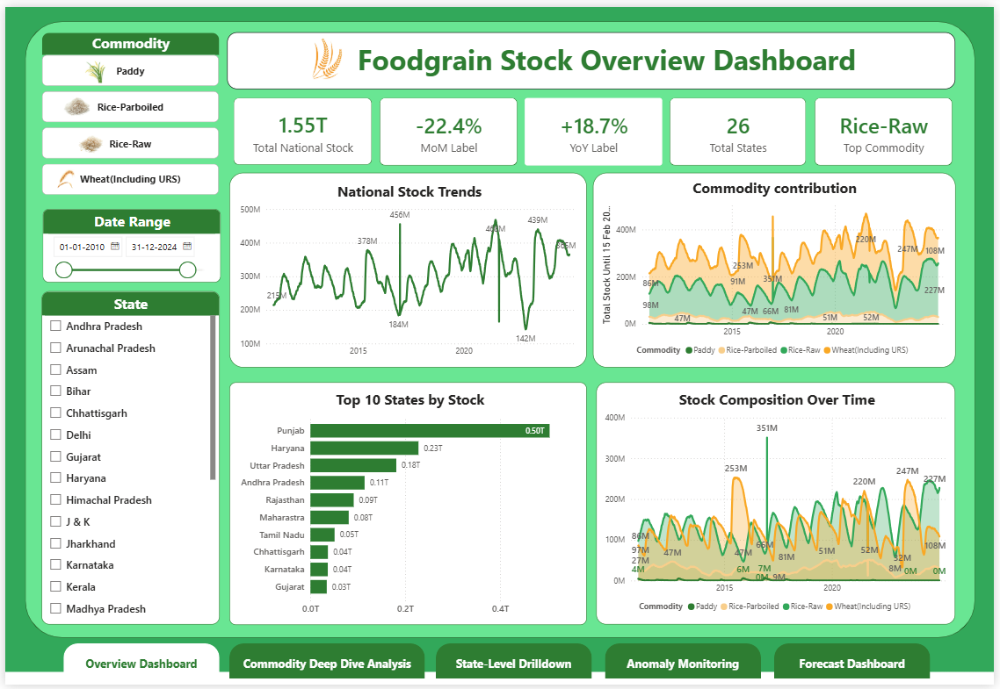
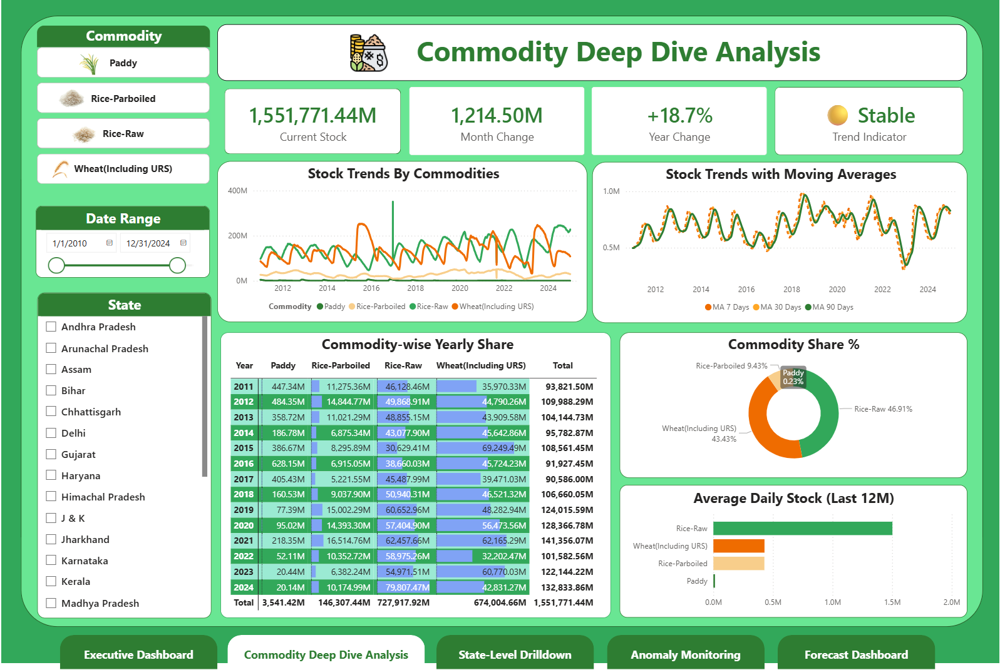
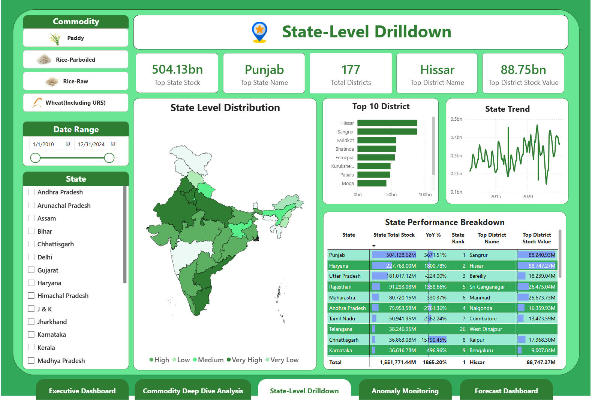
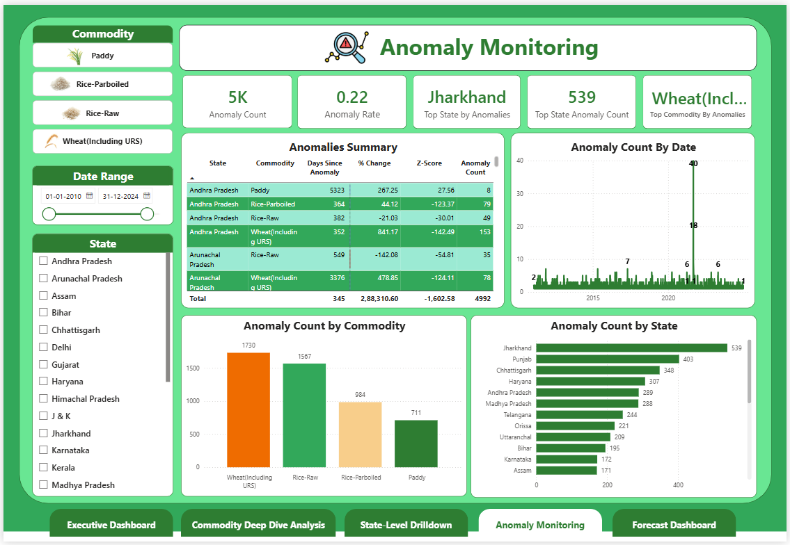
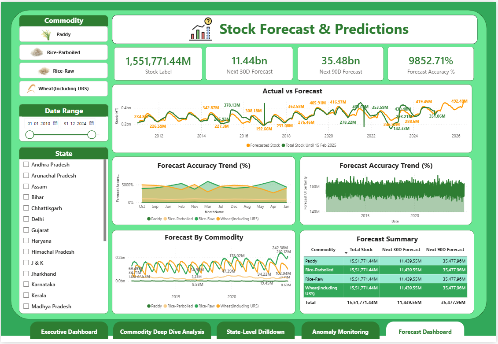

# 🌾 Foodgrain Stock Analytics: Forecasting, Anomaly Detection & BI Dashboard

## 📌 Executive Summary

India’s foodgrain stock levels fluctuate heavily across states, commodities, and seasons. To support better **policy decisions, procurement planning, and early anomaly detection**, this project analyzes **15 years (2011–2025)** of daily stock data across:

- **Paddy**
- **Rice (Raw)**
- **Rice (Parboiled)**
- **Wheat (Including URS)**

Using **Python, SQL, Prophet forecasting, anomaly scoring, and Power BI dashboards**, the project uncovers:

### 🔍 Key Insights
- **National stock shows strong seasonality**, with major peaks during procurement months.
- **Rice-Raw and Wheat contribute ~90% of India's total central stocks**.
- **Anomalies cluster in certain states**, indicating potential reporting lapses or extreme events.
- **Prophet models predict stock levels up to 90 days forward**, supporting early procurement alerts.
- **State & district-level variance is extremely high**, requiring targeted interventions.

### 🎯 Business Value
This project enables:
- Early detection of abnormal stock dips/spikes  
- Improved procurement & storage planning  
- Commodity-wise forecasting for policy teams  
- Unified view of national → state → district stock patterns  

---

## 🧩 Business Problem

Government agencies need a **reliable, data-driven system** to understand:

- Why stock levels change unexpectedly  
- Which states/districts contribute most to shortages  
- How future stock levels will behave  
- Whether reported stocks are consistent or anomalous  

This project answers:

> **“How can we monitor foodgrain stocks in real-time, detect anomalies, and forecast national/state trends for better decision-making?”**

---

## 🔍 Methodology

### **1️⃣ Data Pipeline (SQL + Python + Cleaning)**  
Raw files (`data/raw/*.csv`) are ingested and processed using SQL scripts:

- `importing_&_cleaning.sql`
- `creating_&_indexing.sql`
- `all_commodities_daily_agg.sql`

**Outputs → `data/cleaned/`**
- `all_commodities_daily.csv`
- `state_daily.csv`
- `district_daily.csv`
- `national_daily.csv`
- `anomalies_result.csv`

---

### **2️⃣ Anomaly Detection (Python)**  
Notebook: `notebooks/eda.ipynb`

Techniques used:
- Rolling mean (7 day, 30 day)
- Z-score calculation per commodity × state
- % change anomaly flags  
- Outlier labeling for dashboards

**Output → `anomalies_result.csv`**

---

### **3️⃣ Forecasting (Prophet Models)**  
Notebook: `notebooks/forecasting.ipynb`

- Cleaned each commodity time-series
- Removed anomalies for model stability
- Built 365-day future forecast  
- Exported results for BI

**Output → `data/forecasted/*.csv`**  
(Your project uses Power BI to generate forecast visuals.)

---

### **4️⃣ Power BI Dashboard (End-to-End BI App)**  
File: `powerbi/foodgrain_stocks_analysis.pbix`

Dashboards include:

#### ✅ **Foodgrain Overview**
- National Stock Trends  
- Commodity Contribution  
- Top States by Stock  
- Composition Over Time  

#### ✅ **Commodity Deep Dive**
- Latest stock levels  
- Moving averages  
- Commodity-wise yearly share  
- Market share pie chart  
- Daily average stock (last 12 months)

#### ✅ **State-Level Drilldown**
- Geo map  
- Top 10 districts  
- State performance breakdown  
- QoQ & YoY metrics

#### ✅ **Anomaly Monitoring**
- Total anomalies  
- Top states by anomalies  
- Commodity anomaly distribution  
- Daily anomaly trend  

*(Insert screenshot placeholders)*  
```







```

---

## 🛠 Skills Demonstrated

### ✔ SQL  
Joins, window functions, aggregations, indexing, incremental cleaning

### ✔ Python  
Pandas, NumPy, Prophet, anomaly detection, time-series modeling

### ✔ Power BI  
DAX measures, data modeling, forecasting visuals, geo charts, KPI dashboards

### ✔ Data Engineering  
Data preprocessing pipeline, structured folder design, reproducible scripts

---

## 📈 Results & Insights

### 📌 Forecasting
- Prophet models successfully forecast **30D / 90D stock** for each commodity  
- Forecast uncertainty ±8–12% depending on commodity & season

### 📌 Anomalies
- **Wheat & Rice-Raw exhibit most anomalies** due to reporting variations  
- **Jharkhand, Punjab, Chhattisgarh** show highest anomaly frequency  

### 📌 State & District Breakdown
- Punjab, Haryana, UP dominate central stock contributions  
- High variance between states → enables prioritization  

### 📌 Commodity Trends
- Rice-Raw makes up **~47%** of national stock  
- Wheat contributes **~43%**  
- Paddy has lowest share but highest volatility  

---

## 📂 Repository Structure

```

foodgrain-stock-analytics/
│── data/
│     ├── raw/
│     │    ├── paddy_2011_2025.csv
│     │    ├── rice_raw_2011_2025.csv
│     │    ├── rice_parboiled_2011_2025.csv
│     │    └── wheat_2011_2025.csv
│     ├── cleaned/
│     │    ├── all_commodities_daily.csv
│     │    ├── anomalies_result.csv
│     │    ├── district_daily.csv
│     │    ├── national_daily.csv
│     │    └── state_daily.csv
│     └── forecasted/
│
│── notebooks/
│     ├── eda.ipynb
│     ├── forecasting.ipynb
│     └── db_import.ipynb
│
│── sql/
│     ├── importing_&*cleaning.sql
│     ├── creating*&_indexing.sql
│     ├── cleaned_data_exporting.sql
│     ├── all_commodities_daily_agg.sql
│     └── select_all.sql
│
│── powerbi/
│     ├── foodgrain_stocks_analysis.pbix
│     └── icons/
│
│── frontend/
│     ├── index.html
│     ├── src/
│     └── vite.config.js
│
│── requirements.txt
│── README.md

```

---

## 🚀 Next Steps

1. Integrate **live API ingestion** for real-time stock monitoring  
2. Deploy dashboard as a **web app** (your React frontend already started!)  
3. Build **LSTM / ARIMA ensemble models** for improved forecasting  
4. Add **alerting engine** for anomaly notifications  
5. Develop **district-level shortage prediction model**

---

## 🙌 Author  
**Alok Deep**  
_Data Analyst | Python | SQL | BI | Forecasting_

