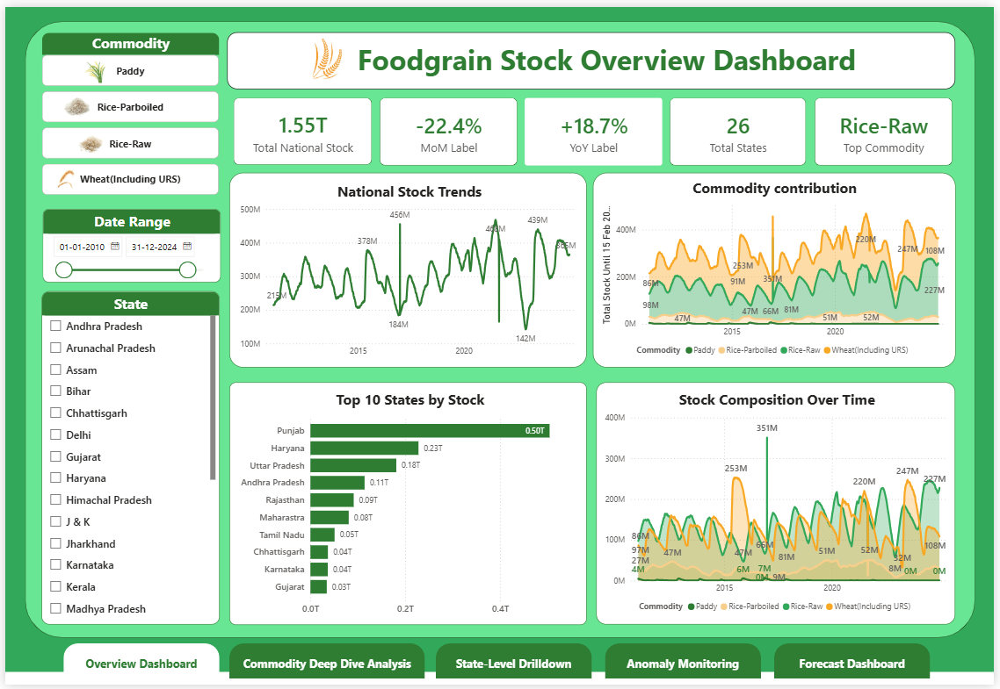
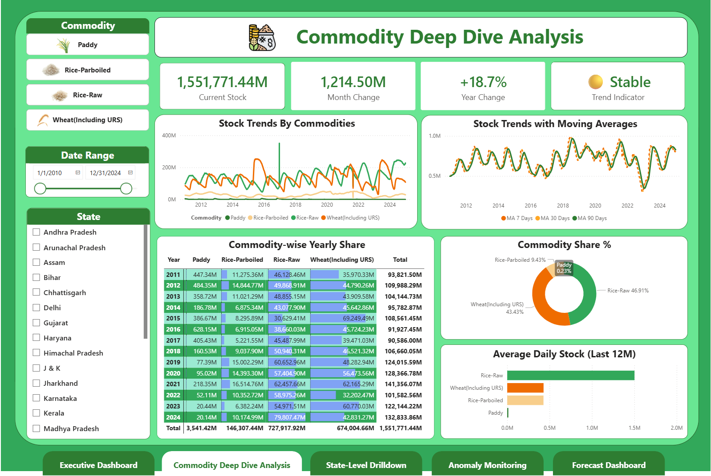
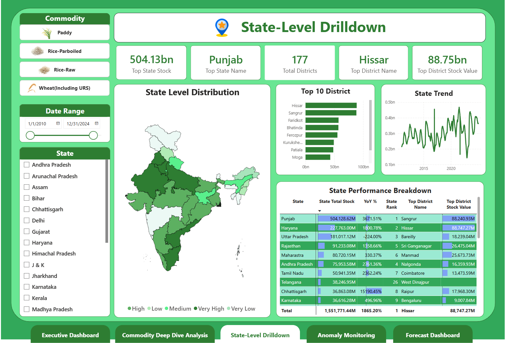
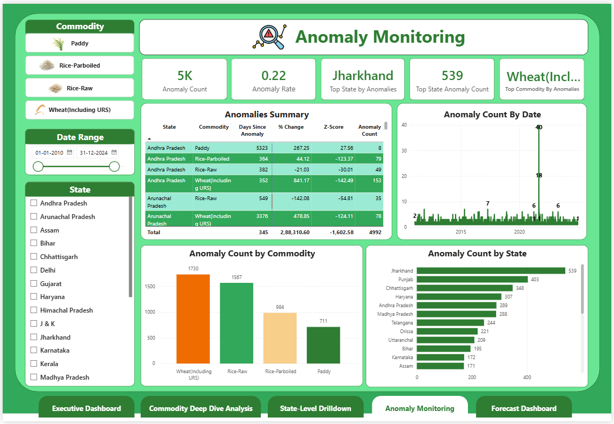
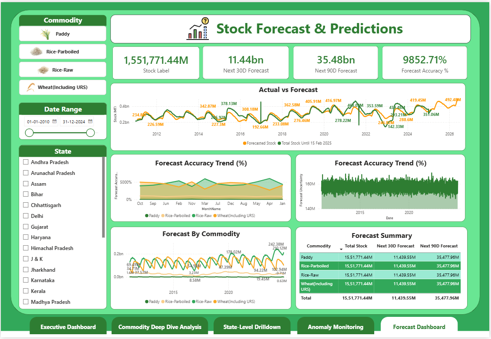

# 🌾 India Foodgrain Stock Analytics
### Forecasting · Anomaly Detection · BI Dashboard

An end-to-end data analytics system for monitoring India's central foodgrain reserves — built to support procurement planning, early anomaly detection, and policy decision-making across 15 years of daily stock data.

[](https://python.org)
[](https://postgresql.org)
[](https://powerbi.microsoft.com)
[](https://facebook.github.io/prophet/)
[]()

---

## Overview

India's foodgrain reserves fluctuate sharply across states, commodities, and procurement seasons. Government agencies managing these stocks need reliable tools to understand unexpected changes, identify at-risk districts, and anticipate future supply levels before shortages develop.

This project delivers that capability. It ingests 15 years (2011–2025) of daily stock data for four commodities — **Paddy, Rice (Raw), Rice (Parboiled), and Wheat** — across all Indian states and districts, then runs it through a structured analytics pipeline covering SQL-based ETL, statistical anomaly detection, Prophet time-series forecasting, and a multi-page Power BI dashboard.

---

## Headline Findings

| # | Finding | Detail |
|---|---------|--------|
| 1 | **Rice-Raw and Wheat dominate national reserves** | Together they account for ~90% of central stock; Rice-Raw ~47%, Wheat ~43% |
| 2 | **Paddy is lowest in volume but highest in volatility** | Largest coefficient of variation across all commodities |
| 3 | **500+ anomalies identified across the dataset** | Clustering in Jharkhand, Punjab, and Chhattisgarh — indicating reporting lapses or extreme procurement events |
| 4 | **Wheat and Rice-Raw show most anomalies** | Driven by irregular reporting cadence and large procurement swings |
| 5 | **Prophet forecasts within ±8–12% uncertainty** | 30-day and 90-day forward estimates validated against held-out periods |
| 6 | **Punjab, Haryana, and UP supply the bulk of central stocks** | High inter-state variance enables prioritisation of monitoring effort |

---

## Dashboard Pages


### Overview
National stock trend line, commodity contribution over time, top states by reserve volume, and a composition area chart showing the share of each commodity across 15 years.


### Commodity Deep Dive
Latest stock level per commodity, 7-day and 30-day moving averages, yearly market share breakdown, and daily average for the trailing 12 months.


### State-Level Drilldown
India choropleth map, top-10 districts by stock volume, state-vs-state performance comparison, and QoQ and YoY delta metrics with conditional formatting.


### Anomaly Monitoring
Total anomaly count with trend, top states by anomaly frequency, commodity-wise anomaly distribution, and a daily anomaly timeline for operational alerting.


### Forecasting
30-day and 90-day Prophet forecasts per commodity, forecast uncertainty bands, and comparison against actuals for the most recent completed quarter.

---

## Architecture

```
data/raw/*.csv  (2.2M+ rows across 4 commodities, 2011–2025)
       │
       ▼
sql/importing_&_cleaning.sql        ← Ingest, deduplicate, type-cast
sql/creating_&_indexing.sql         ← Schema + performance indexes
sql/all_commodities_daily_agg.sql   ← National / state / district rollups
       │
       ▼
data/cleaned/
  ├── national_daily.csv
  ├── state_daily.csv
  ├── district_daily.csv
  ├── all_commodities_daily.csv
  └── anomalies_result.csv
       │
       ├──────────────────────────────────────────┐
       ▼                                          ▼
notebooks/eda.ipynb                   notebooks/forecasting.ipynb
  Z-score anomaly detection             Prophet model per commodity
  Rolling mean (7d, 30d)                365-day forward forecast
  % change flags                        Anomaly-filtered training set
  → anomalies_result.csv              → data/forecasted/*.csv
       │                                          │
       └──────────────┬───────────────────────────┘
                      ▼
         powerbi/foodgrain_stocks_analysis.pbix
              5-page interactive dashboard
```

## Skills Demonstrated

**SQL** — multi-table joins, window functions, incremental cleaning, indexing strategy, and aggregation rollups from district → state → national level

**Python** — Pandas and NumPy for pipeline orchestration; Z-score and rolling-window anomaly detection; Facebook Prophet for time-series modelling with anomaly-filtered training sets

**Power BI** — 30+ DAX measures, star schema data model, geo map visuals, KPI cards with conditional formatting, and forecast visuals with confidence intervals

**Data Engineering** — structured folder layout, reproducible SQL + notebook pipeline, clean separation of raw / cleaned / forecasted data layers

---

## Repository Structure

```
foodgrain-stock-analytics/
├── data/
│   ├── raw/                        # Source CSVs (2.2M+ rows)
│   │   ├── paddy_2011_2025.csv
│   │   ├── rice_raw_2011_2025.csv
│   │   ├── rice_parboiled_2011_2025.csv
│   │   └── wheat_2011_2025.csv
│   ├── cleaned/                    # Pipeline outputs
│   │   ├── all_commodities_daily.csv
│   │   ├── national_daily.csv
│   │   ├── state_daily.csv
│   │   ├── district_daily.csv
│   │   └── anomalies_result.csv
│   └── forecasted/                 # Prophet model outputs
│
├── notebooks/
│   ├── eda.ipynb                   # EDA + anomaly detection
│   ├── forecasting.ipynb           # Prophet modelling + export
│   └── db_import.ipynb             # Database ingestion helper
│
├── sql/
│   ├── importing_&_cleaning.sql
│   ├── creating_&_indexing.sql
│   ├── cleaned_data_exporting.sql
│   ├── all_commodities_daily_agg.sql
│   └── select_all.sql
│
├── powerbi/
│   ├── foodgrain_stocks_analysis.pbix
│   └── icons/
│
├── frontend/                       # React web app (in progress)
│   ├── index.html
│   ├── src/
│   └── vite.config.js
│
├── requirements.txt
└── README.md
```

---

## Getting Started

```bash
# 1. Install Python dependencies
pip install -r requirements.txt

# 2. Run SQL pipeline (PostgreSQL or MySQL)
#    Execute scripts in this order:
#    sql/importing_&_cleaning.sql
#    sql/creating_&_indexing.sql
#    sql/all_commodities_daily_agg.sql
#    sql/cleaned_data_exporting.sql

# 3. Run notebooks
jupyter lab notebooks/eda.ipynb           # Anomaly detection
jupyter lab notebooks/forecasting.ipynb   # Prophet forecasting

# 4. Open the dashboard
#    Open powerbi/foodgrain_stocks_analysis.pbix in Power BI Desktop
#    Point the data source to data/cleaned/
```

---

## Roadmap

- Live API ingestion for real-time stock monitoring
- Deploy as full web app (React frontend scaffolded)
- LSTM / ARIMA ensemble to complement Prophet forecasts
- Alerting engine for anomaly notifications via email or webhook
- District-level shortage prediction model

---

## Author

**Alok Deep** — Data Analyst | Python · SQL · Power BI · Forecasting

[LinkedIn](https://www.linkedin.com/in/alok-deep-3381b027b) · [Portfolio](https://alok-deep.vercel.app/) · [Email](mailto:alokdeep9925@gmail.com)

---

*All data sourced from publicly available government foodgrain stock reports. This project is for analytical and portfolio purposes.*
